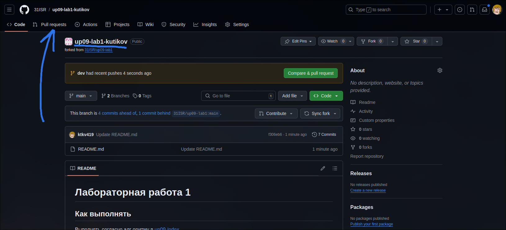
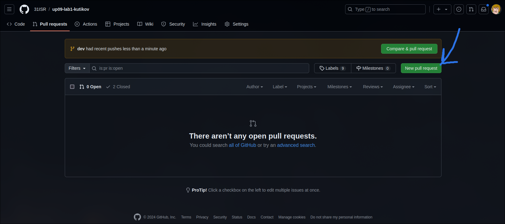
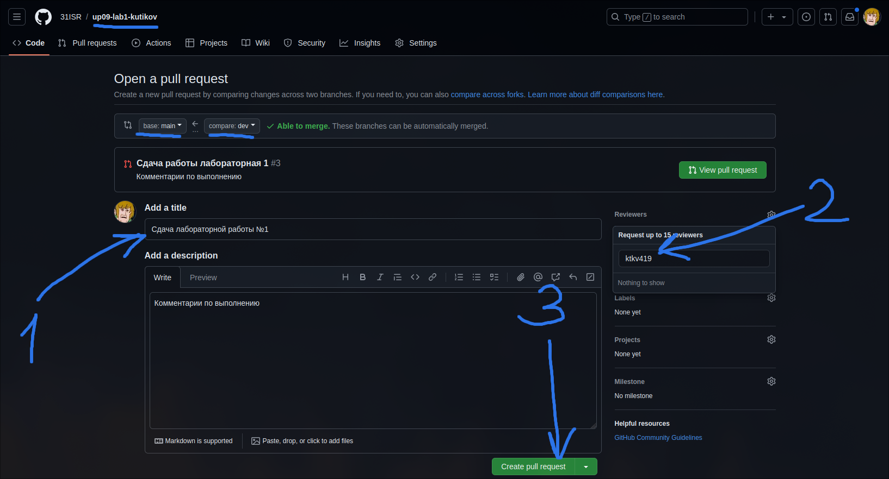

# Разработка пользовательских интерфейсов

## Содержание

1. [Лидерборд](https://docs.google.com/spreadsheets/d/12AMe72B-rCRVmvi8imSFIQohUloxABgn/edit?gid=1920332676#gid=1920332676)
1. [Roadmap](#roadmap)
1. [Как выполнять задания](#как-выполнять-задания)
1. [Документация](#документация)
1. [Полезное](#полезное)

## Roadmap

Все, что находится выше `Мы здесь` должно быть у вас для успешного прохождения дисциплины

### 1. Git

[Презентация по Git](https://ktkv-presentations.github.io/algos-8/)

### 2. Основы HTML верстки

- [HTMLAcademy (все 5 модулей)](https://htmlacademy.ru/courses/299)

- [Лабораторная работа №1](https://github.com/21isr/uidev-lab1)

⬇ Мы здесь

- [HTML Academy Recap (только модуль с HTML](https://htmlacademy.ru/courses/297)

- [Лабораторная работа №2](https://github.com/21isr/uidev-lab2)

- [CSS Diner (CSS селекторы)](https://flukeout.github.io/)

- [Лабораторная работа №3](https://github.com/21isr/uidev-lab3)
 
## Как выполнять задания

В каждом репозитории описано как выполнять задание. В случае, если не указано, то работать по следующему принципу:

### Как начать выполнять

1. Создайте fork репозитория в организации [21ISR](https://github.com/21ISR) под названием `uidev-lab{N}-{фамилия}`
    - `N` - номер лабораторной работы
2. Переключитель на ветку `dev` (левый-верхний угол)
3. Запустите Codespace (Code => Codespace)

### Как работать

Для отправки ветки `dev` на репозиторий GitHub необходимо: - Создать коммит `git add .` и `git commit -m "{Что делали}"` - Отправить коммит на GitHub `git push -u origin dev`

### Как сдавать

При успешном выполнении задания:

- Делайте коммит
- Добавляйте [pull request](#как-делать-pull-request) из `dev` в `main` в **вашем репозитории**
- Указывайте меня ([ktkv419](https://github.com/ktkv419)) как reviewer

При успешной сдаче задания pull request будет закрыт и последним сообщением перед закрытием реквеста будут написаны мои комментарии и оценка

### Как делать pull request

_Обратите внимание, что это делается в **вашем** репозитории, где вы работали_

1. Откройте вкладку Pull requests

    

2. Создайте новый PR

    

3. Перепроверье, что изменения сливаются из ветки `dev` (справа) в ветку `main` (слева) и создайте новый PR

    
    

В случае успешной сдачи работы вы увидите мои комментарии по поводу работы, оценку и что реквест был слит с веткой main

## Установка ПО

???

## Документация

## Полезное

- [MDN](https://developer.mozilla.org/ru/docs/Web/)
- [Git шпаргалка](https://github.com/cyberspacedk/Git-commands)
