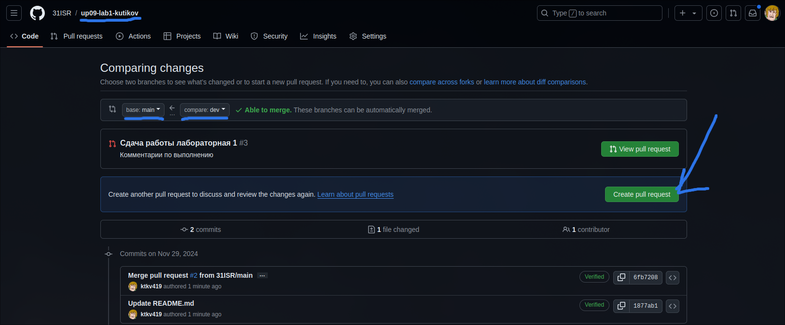
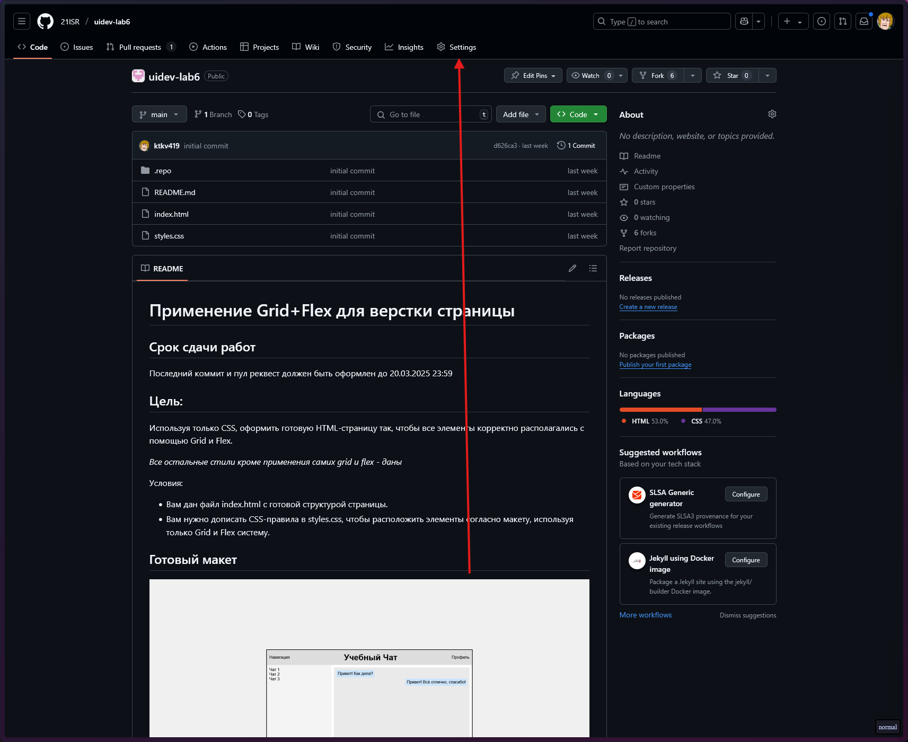
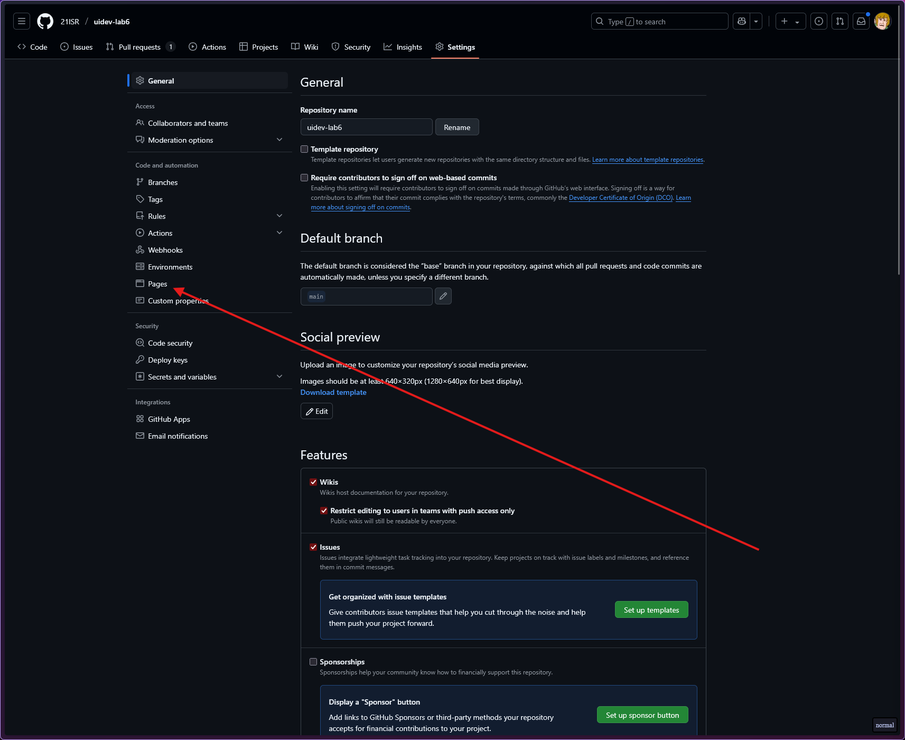
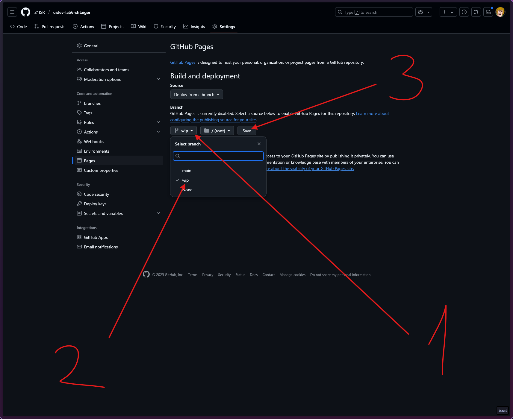
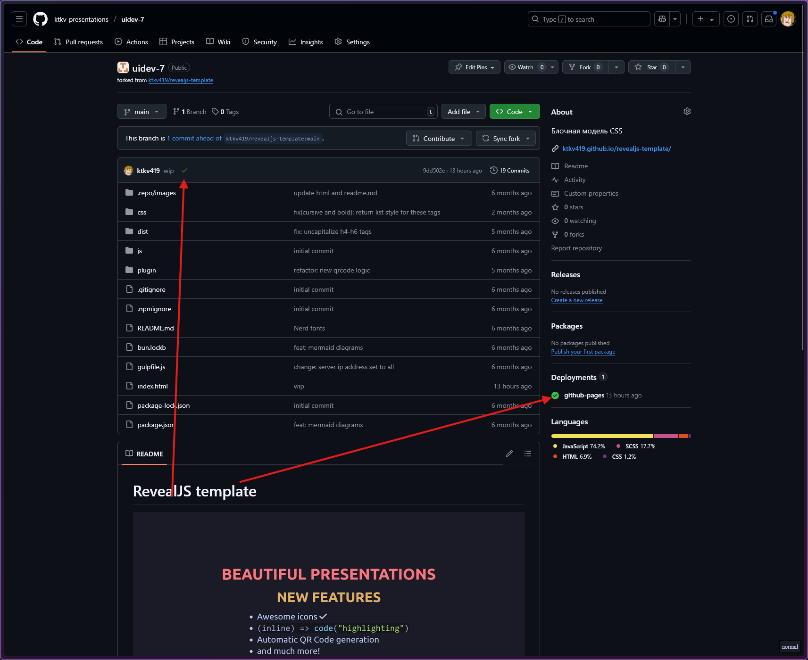
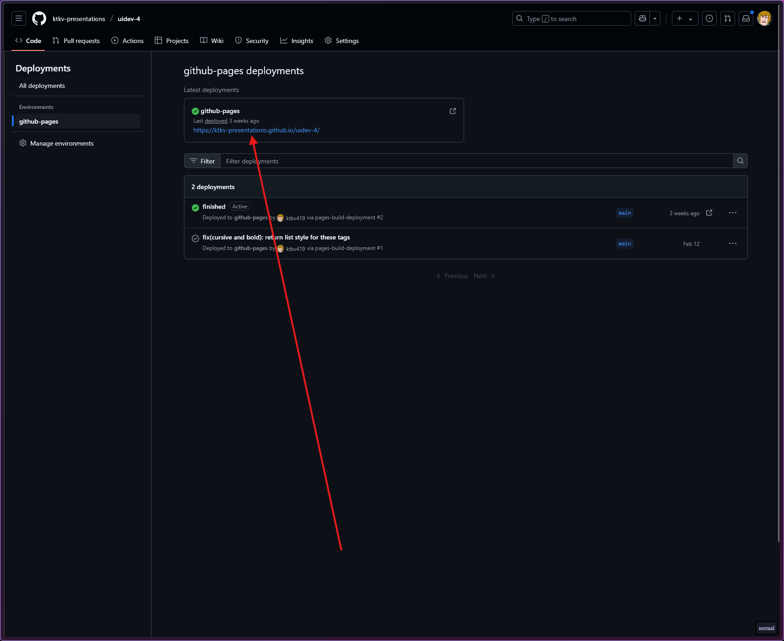

# Разработка пользовательских интерфейсов

## Содержание

1. [Лидерборд](https://docs.google.com/spreadsheets/d/1QlNnNLg2CPhlmlyUgOBSfg_bartMvMlxeVB-7SPv8zw/edit?usp=sharing)
1. [Roadmap](#roadmap)
1. [Как выполнять задания](#как-выполнять-задания)
1. [Документация](#документация)
1. [Полезное](#полезное)

## Roadmap

### Лекции

- [Web-приложения и web-протоколы](https://ktkv-presentations.github.io/uidev-1/)
- [Разработка структуры Web-узла](https://ktkv-presentations.github.io/uidev-2/)
- [HTML](https://ktkv-presentations.github.io/uidev-3/)
- [Веб-доступность](https://ktkv-presentations.github.io/uidev-4/)
- [CSS - Каскадные таблицы стилей](https://ktkv-presentations.github.io/uidev-5/)
- [Текст и все с ним связанное](https://ktkv-presentations.github.io/uidev-6/)
- [Блочная модель CSS](https://ktkv-presentations.github.io/uidev-7/)

### Лабораторные

#### Введение в HTML

[HTML Academy #1](https://htmlacademy.ru/courses/297/)

[HTML Academy #2](https://htmlacademy.ru/courses/299)

## Как выполнять задания

В каждом репозитории описано как выполнять задание. В случае, если не указано, то работать по следующему принципу:

### Как начать выполнять

1. Создайте fork репозитория в организации [31isr](https://github.com/31isr) под названием `uidev-lab{N}-{фамилия}`
    - `N` - номер лабораторной работы

2. Переключитель на ветку `dev` (левый-верхний угол)

3. Запустите Codespace (Code => Codespace)

_Либо запускайте сразу на нужной ветке, либо переключайтесь в терминале кодспейса_

### Как сохранять работу

Для отправки ветки `dev` на репозиторий GitHub необходимо:

- Добавить все измененные файлы в следующий коммит `git add .`

_Обратите внимание, что `.` это текущая папка. Соответственно, если вы находитесь в какой-либо папке внутри репозитория, то будут добавлены изменения только из папки_

- Создайте коммит `git commit -m "{Что делали}"`

_В кавычках постарайтесь описать что вы делали в текущем коммите, особенно если работа у вас заняла больше 1 коммита_

- Отправить коммит на GitHub `git push -u origin dev`

_Обратите внимание на последнее слово - это название вашей ветки_

### Как выполнять лабораторные работы

#### Работа

- Создайте форк репозитория в этой организации с названием `изначальное_название_репозитория-вашафамилия`
- Используя ветку dev сделайте задание
- Зафиксируйте изменения в вашем репозитории

Не мержите сами коммит, это сделаю я после проверки задания

#### Сдача

При успешном выполнении задания:

- Делайте коммит
- Захостите работу с помощью [Github Pages](#как-хостить-работу)
*Проверьте, что на Pages все работает так, как в задумывали*
- Добавляйте [pull request](#как-делать-pull-request) из `dev` в `main` в **вашем репозитории**
- Указывайте меня ([ktkv419](https://github.com/ktkv419)) как reviewer
- *Если работу закончили на паре - покажите мне, я сразу дам комментарии по поводу выполнения*

При успешной сдаче задания pull request будет закрыт и последним сообщением перед закрытием реквеста будут написаны мои комментарии и оценка

### Как делать pull request

_Обратите внимание, что это делается в **вашем** репозитории, где вы работали_

1. Откройте вкладку Pull requests

    

2. Создайте новый PR

    

3. Перепроверье, что изменения сливаются из ветки `dev` (справа) в ветку `main` (слева) и создайте новый PR

    
    

В случае успешной сдачи работы вы увидите мои комментарии по поводу работы, оценку и что реквест был слит с веткой main

### Как хостить работу

_Обратите внимание, что это делается в **вашем** репозитории, где вы работали_

1. Откройте настройки проекта и вкладку `Pages`

    

    

2. Укажите ветку в которой вы выполняли работу и нажмите сохранить

_чаще всего это либо `dev`, либо `wip`_

    

3. Удостоверьтесь, что работа была захосчена успешно

_об этом будет сигнализировать галочки у последнего коммита и в категории `Deployments`, также удостоверьтесь, что работа доступна по ссылке внутри деплоя `github-pages`_

    

    

## Документация/Полезное
- [MDN - официальная документация HTML/CSS/JS](https://developer.mozilla.org/ru/docs/Web/)
- [Дока - более практическая документация](https://doka.guide/)
- [Git шпаргалка](https://github.com/cyberspacedk/Git-commands)
